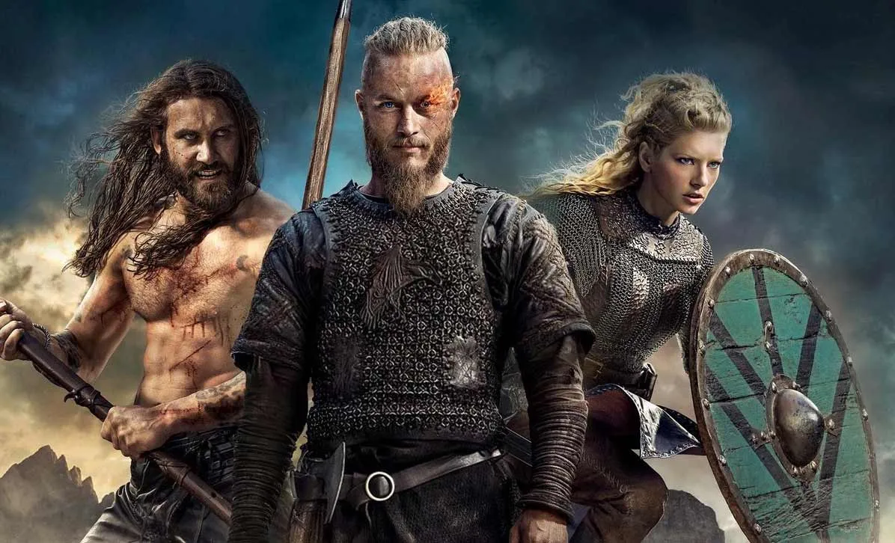
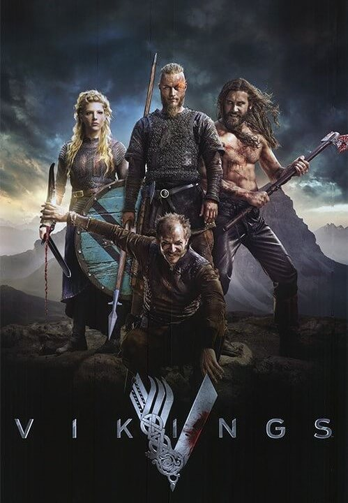

# _Vikings_

Esta es una serie muy interesante desde el inicio hasta el fin, como se puede ver esta muy bien producida y sus vestuarios como su desarrrollo de historia basada en la historia de un vikingo llamada "Ragna" uno de los vikingos mas temidos de todos los pueblos cristianos.
Dentro de esta epica historia se desarrolla en la piel de los vikingos, su cultura y lo dificil que era sobrevivir en esos tiempos, como tambien sus costrumbres y cultura llena de simbolos tan diferentes de las que se conocen actualmente.
Para aquellos que les gustan las series de accion, tendran suficientes batallas llenas de hombres luchando y destrozandose llenando la pantalla con sangre y sonidos tan reales que te haran inmersiva a tal nivel que te quedaras picado episodio tras episodio.

Es una historia epica de guerras y muchas batallas y lo que contruyo el camino para la creacion de la civilizacion de Noruega y Finlandia, Suecia. Cuenta un poco de como fueron desarrollandose estas civilizaciones de vikingos en base a la guerra, el comercio y la distintas alianzas con otras naciones de la antigua edad. Dentro de sus muchas ramas se puede decir que vikings lograr meterte en un mundo crudo, dificil de sobrevivir y sentir como era la vida en la edad media. Una serie muy recomendada para los fanaticos de las culturas antiguas, origenes y de la historia, puesto que se tocan muchas batallas escritas en la historia, guiños culturales y mas...

[Home]({{ '/' | url }})
